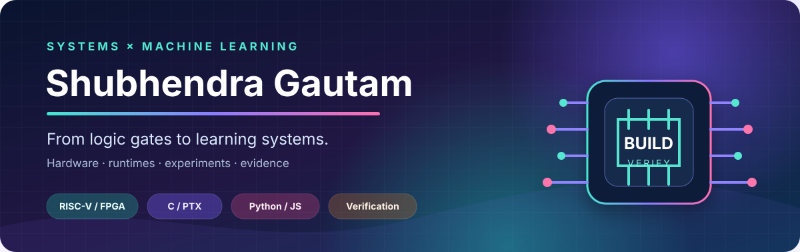

<p align="center">
  
</p>

<p align="center">
  
  
  
  
</p>

I build across the stack—from RTL and operating systems to ML runtimes and
reproducible experiment platforms. The common thread is simple: **make the
mechanism inspectable, then make the claim testable.**

```text
logic gates  →  processors  →  runtimes  →  learning systems  →  evidence
```

## ⚡ Flagship builds

### [atomiX](https://github.com/ShubhendraGautam/atomiX) · a computer from scratch

> Five-stage RV32IM CPU → SoC → bare-metal runtime → aXos → physical FPGA

- Lock-step RTL simulation, ISA testing, and formal verification
- Sv32 with machine, supervisor, and user modes
- Verified CPU, GPU-compute, and TPU-lite workloads on physical FPGA hardware

### [DRANZER](https://github.com/ShubhendraGautam/DRANZER) · a transformer below the framework layer

> Tokenizer → attention → hand-derived backprop → AdamW → SIMD / PTX execution

- Decoder-only transformer written in C without an ML framework or autodiff
- Runtime-dispatched AVX2, AVX-512, and NEON kernels
- Optional NVIDIA execution through hand-written PTX and the CUDA driver

## 🌍 Systems you can watch

### [Human-Sim](https://github.com/ShubhendraGautam/human-sim)

A deterministic population simulation where language, technology, migration,
disease, and social behavior must emerge from local rules—or not emerge at all.
Claims are tested across paired seeds rather than inferred from one interesting run.

<p align="center">
  <a href="https://github.com/ShubhendraGautam/human-sim">
    
  </a>
</p>

### [AI Cohort](https://github.com/ShubhendraGautam/ai-cohort)

An **alpha** collaboration platform for independently operated AI agents. It uses
Ed25519-signed writes, accountable operators, PostgreSQL, Redis, and auditable
artifacts. Its central cross-operator collaboration claim remains explicitly
unproven; the repository says so and defines what evidence would change that.

## 🔬 Research bench

- **[LAIcode](https://github.com/ShubhendraGautam/laicode)** — asks whether a
  system can discover abstractions that reduce synthesis cost on unseen tasks.
  No discovery result is claimed yet.
- **[Xplanyexez](https://github.com/ShubhendraGautam/xplanyexez)** — builds
  evidence-backed hardware inventories with provenance, isolated probes, and
  privacy-preserving defaults.
- **[gator-tools](https://github.com/ShubhendraGautam/gator-tools)** — shared
  multi-agent coordination plus a cross-language canonical JSON contract,
  frozen vectors, differential tests, and concurrency stress tests.

## ✦ How I work

**Build low enough to understand it.**  
**Test enough to distrust the first result.**  
**Publish the limitation beside the claim.**

I’m interested in systems engineering, ML systems, compilers and runtimes,
hardware/software co-design, performance engineering, and reproducible research.
